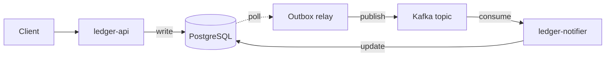

# ledger-flow

**An event-driven transaction ledger built with Java 21, Spring Boot and Kafka, a working reference implementation of the transactional outbox pattern.**


---

## What this is, and why it is useful

Any service that writes to a database and publishes to a message broker carries a bug waiting to happen: the two operations cannot commit together, so a crash between them either loses the event or invents one. In a payment system that means a transaction recorded but never settled, or a customer charged twice — failures that are silent, discovered days later, and expensive to reconcile.

`ledger-flow` implements the standard industry answer to that problem end to end: a transactional outbox, idempotent intake keyed on a client-supplied header, and consumers that deduplicate rather than assume delivery happens exactly once. Every guarantee is exercised by tests that inject the failure instead of hoping it never occurs — broker unreachable, duplicate delivery, crash between commit and publication.

It is built to be lifted. Clone it and run it as a service, or take the outbox and idempotency modules into an existing codebase. The reasoning behind each decision is recorded in [`docs/adr/`](docs/adr/), so the *why* travels with the code.

## Status

**Current milestone: M1 — Foundations.** See the [roadmap](#roadmap) for what is built and what is not.

This section states only what a passing test in CI demonstrates. Nothing is described as working before that is true — a README that overstates is worse than no README, because the first person to run the project finds out.

| Guarantee | Backed by | Status |
| --- | --- | --- |
| Ledger write and event emission are atomic | `OutboxIntegrationTest` | Not yet implemented |
| Duplicate intake is rejected | `IdempotencyKeyIT` | Passing in CI |
| Redelivered events leave balances unchanged | `NotifierDeduplicationTest` | Not yet implemented |
| Events survive a broker outage | `BrokerOutageTest` | Not yet implemented |

## Architecture



| Concern | Mechanism |
| --- | --- |
| No lost events | Ledger row and outbox row written in one database transaction |
| No duplicate charges | `Idempotency-Key` header, unique-constrained at the database level |
| Safe redelivery | Consumers deduplicate on event ID; effects are idempotent |
| Ordering per account | Kafka partitioning by account ID |

## Tech stack

| Layer | Choice | Licence |
| --- | --- | --- |
| Language | Java 21 (Temurin) | GPLv2 + Classpath Exception |
| Framework | Spring Boot 3 | Apache-2.0 |
| Broker | Apache Kafka (KRaft mode) | Apache-2.0 |
| Database | PostgreSQL 16 | PostgreSQL Licence |
| Migrations | Flyway | Apache-2.0 |
| Testing | JUnit 5, Testcontainers, AssertJ | EPL-2.0 / MIT |
| Quality gates | Spotless, Error Prone, JaCoCo | Apache-2.0 / MIT |
| CI | GitHub Actions | — |

Every dependency is open source. The project runs on a laptop with no cloud account and no paid service.

## Getting started

> Prerequisites: JDK 21, PostgreSQL 16, and Kafka reachable on `localhost:9092`.

```bash
git clone https://github.com/<user>/ledger-flow.git
cd ledger-flow
./mvnw verify
```

Detailed setup lives in [`docs/DEVELOPMENT.md`](docs/DEVELOPMENT.md). The API contract is published as OpenAPI at `/swagger-ui.html` once the service is running.

## Before you run this in production

This is a reference implementation, and it is honest about where it stops. Anyone adopting it should plan for the following:

- **Authentication.** The API is unauthenticated by design, to keep the pattern legible. Put OAuth2 or mTLS in front of it.
- **Outbox growth.** Published rows accumulate. A pruning job or partition rotation is required before sustained load.
- **Relay throughput.** The relay polls, which is simple and observable but bounded. Above roughly a few hundred writes per second, replace it with change data capture — see [ADR-0002](docs/adr/0002-transactional-outbox-for-event-publication.md).
- **Broker durability.** The demo configuration runs a single Kafka broker. Production needs a replication factor of at least three with `min.insync.replicas=2`.
- **Monetary amounts** are stored in minor units as integers, never floating point. Multi-currency conversion and reversals are out of scope.
- **Single-node deployment.** The demo environment has no high availability and no disaster recovery.

## Roadmap

Tracked in [Issues](../../issues), grouped into [milestones](../../milestones).

- [ ] **M1 — Foundations.** Project skeleton, database schema, CI pipeline green.
- [ ] **M2 — Intake.** `POST /transactions` with idempotency-key handling and validation.
- [ ] **M3 — Outbox.** Atomic ledger and outbox write, polling relay, publication to Kafka.
- [ ] **M4 — Consumer.** `ledger-notifier` with deduplication and status projection.
- [ ] **M5 — Proof.** Failure-injection tests: broker down, duplicate delivery, crash mid-publish.
- [ ] **M6 — Operability.** Health checks, metrics, structured logs, container image, public demo.

## Architecture decision records

Significant decisions are documented rather than remembered. See [`docs/adr/`](docs/adr/).

## Licence

Released under the [MIT Licence](LICENSE).
