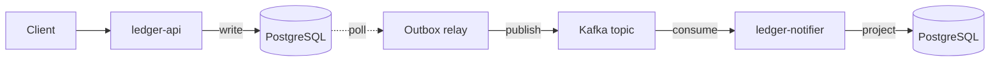

# ledger-flow

**An event-driven transaction ledger built with Java 21, Spring Boot and Kafka — a working reference implementation of the transactional outbox pattern.**

[](https://github.com/simonvildonelohim/ledger-flow/actions/workflows/ci.yml)


---

## What this is, and why it is useful

Any service that writes to a database and publishes to a message broker carries a bug waiting to happen: the two operations cannot commit together, so a crash between them either loses the event or invents one. In a payment system that means a transaction recorded but never settled, or a customer charged twice — failures that are silent, discovered days later, and expensive to reconcile.

`ledger-flow` implements the standard industry answer to that problem end to end: a transactional outbox, idempotent intake keyed on a client-supplied header, a relay that publishes only after the broker acknowledges, and a consumer that deduplicates rather than assuming delivery happens exactly once. Every guarantee is exercised by tests that inject the failure instead of hoping it never occurs — a write that fails mid-transaction, the same key submitted eight times at once, a broker that is not there, an event delivered twice.

It is built to be lifted. Clone it and run it, or take the outbox and idempotency modules into an existing codebase. The reasoning behind each decision is recorded in [`docs/adr/`](docs/adr/), so the *why* travels with the code.

## Status

**Current milestone: M5 — Proof.** See the [roadmap](#roadmap) for what is built and what is not.

This table states only what a passing test in CI demonstrates. Nothing is described as working before that is true — a README that overstates is worse than no README, because the first person to run the project finds out.

| Guarantee | Backed by | Status |
| --- | --- | --- |
| Ledger write and event emission are atomic | `OutboxAtomicityIT` | Passing in CI |
| Duplicate intake is rejected | `IdempotencyKeyIT` | Passing in CI |
| Events survive a broker outage | `BrokerOutageIT` | Passing in CI |
| Redelivered events are handled once | `NotifierDeduplicationIT` | Passing in CI |

## Tracing a transaction

The whole stack runs locally:

```
docker compose up
```

This brings up both databases, the broker, and both services. First start
takes a few minutes while the images build and Postgres initialises.

Send a transaction, supplying your own correlation id:

```
curl -i -X POST http://localhost:8080/transactions \
  -H "Content-Type: application/json" \
  -H "Idempotency-Key: demo-001" \
  -H "X-Correlation-Id: demo-trace-1" \
  -d '{"accountId":"acct-001","amountMinor":12500,"currency":"CAD"}'
```

The response comes back before the event reaches the broker — the caller
does not wait on Kafka:

```
HTTP/1.1 201
X-Correlation-Id: demo-trace-1

{"id":"a9bc6623-...","accountId":"acct-001","amountMinor":12500,
 "currency":"CAD","status":"PENDING","createdAt":"..."}
```

One grep then follows that transaction across both services:

```
docker compose logs | grep demo-trace-1
```

```
ledger-api       Accepted transaction id=a9bc6623-... accountId=acct-001 amountMinor=12500 currency=CAD
ledger-api       Relayed outbox event id=e7b5334c-... to the broker
ledger-notifier  Consumed TransactionAccepted transactionId=a9bc6623-... accountId=acct-001 ...
```

Accepted, relayed, consumed — three log lines, two services, one id.

The id survives two hops it has no business surviving. The MDC is a
thread-local, so it is long gone by the time the relay runs on a scheduler
thread; it survives because it is written into the outbox row alongside the
event. It reaches the consumer because the publisher puts it on a Kafka
header. Without either step the trail stops at the HTTP response.

On Windows, replace `grep` with `Select-String`.

## Architecture



| Concern | Mechanism |
| --- | --- |
| No lost events | Ledger row and outbox row written in one database transaction |
| No duplicate charges | `Idempotency-Key` header, unique-constrained at the database level |
| Safe redelivery | Consumers claim the event id in the same transaction as the effect |
| Ordering per account | Kafka partitioning by account ID |
| Independent services | Each owns its database; nothing is shared but the topic |

## API

One endpoint so far.

```
POST /transactions
Idempotency-Key: <client-supplied key>       required

{"accountId": "acct-001", "amountMinor": 12500, "currency": "CAD"}
```

| Response | Meaning |
| --- | --- |
| `201 Created` | The transaction was written and an event is queued for publication |
| `200 OK` | This key was already used; the original transaction is returned unchanged |
| `400 Bad Request` | The header is missing, or a field failed validation |
| `409 Conflict` | The request conflicts with existing data |

Errors follow [RFC 9457](https://www.rfc-editor.org/rfc/rfc9457) and name the rejected fields:

```json
{
  "type": "https://github.com/simonvildonelohim/ledger-flow/problems/validation-failed",
  "title": "Invalid request",
  "status": 400,
  "detail": "One or more fields are invalid.",
  "errors": { "currency": "must be a valid ISO-4217 currency code" }
}
```

Amounts are integers in minor units — cents, not dollars. Binary floating point cannot represent most decimal fractions exactly, and the error is unbounded across a ledger.

Status is not read from this API. It is projected by `ledger-notifier` into its own database, for the reasons in [ADR-0004](docs/adr/0004-notifier-owns-the-status-projection.md).

## Tech stack

| Layer | Choice | Licence |
| --- | --- | --- |
| Language | Java 21 (Temurin) | GPLv2 + Classpath Exception |
| Framework | Spring Boot 4 | Apache-2.0 |
| Broker | Apache Kafka (KRaft mode) | Apache-2.0 |
| Database | PostgreSQL 16 | PostgreSQL Licence |
| Migrations | Flyway | Apache-2.0 |
| Testing | JUnit 5, Testcontainers, AssertJ, Awaitility | EPL-2.0 / MIT |
| CI | GitHub Actions | — |

Every dependency is open source. The project runs on a laptop with no cloud account and no paid service.

## Getting started

> Prerequisites: JDK 21 and PostgreSQL 16.

```bash
git clone https://github.com/simonvildonelohim/ledger-flow.git
cd ledger-flow
./mvnw test
```

`./mvnw test` runs the unit tests and needs nothing but a JDK. `./mvnw verify` also runs the integration tests, which start real PostgreSQL and Kafka containers through Testcontainers and therefore need a Docker daemon. Both run on every push; the integration suite is what proves the guarantees in the table above.

Detailed setup lives in [`docs/DEVELOPMENT.md`](docs/DEVELOPMENT.md).

## Before you run this in production

This is a reference implementation, and it is honest about where it stops. Anyone adopting it should plan for the following:

- **Authentication.** The API is unauthenticated by design, to keep the pattern legible. Put OAuth2 or mTLS in front of it.
- **Unbounded tables.** Published outbox rows and processed event ids both accumulate. Pruning or partition rotation is required before sustained load.
- **Poison messages.** A message that cannot be parsed, or that carries no event id, is logged and dropped. A dead-letter topic is the production answer.
- **Relay throughput.** The relay polls, which is simple and observable but bounded. Above roughly a few hundred writes per second, replace it with change data capture — see [ADR-0002](docs/adr/0002-transactional-outbox-for-event-publication.md).
- **Broker durability.** The demo configuration runs a single Kafka broker. Production needs a replication factor of at least three with `min.insync.replicas=2`.
- **Eventual consistency.** A client that submits a transaction and immediately asks for its status may still see nothing. That window is unbounded while the broker is unavailable.
- **Contract drift.** The two services agree on the event payload by inspection. Nothing exercises both in one run yet.
- **Single-node deployment.** The demo environment has no high availability and no disaster recovery.

## Roadmap

Tracked in [Issues](../../issues).

- [x] **M1 — Foundations.** Project skeleton, database schema, CI pipeline green.
- [x] **M2 — Intake.** `POST /transactions` with idempotency-key handling and validation.
- [x] **M3 — Outbox.** Atomic ledger and outbox write, polling relay, publication to Kafka.
- [x] **M4 — Consumer.** `ledger-notifier` with deduplication and status projection.
- [ ] **M5 — Proof.** The full stack under one compose file, with scripted failures and a runbook.
- [ ] **M6 — Operability.** Structured logs with a correlation id, metrics, a declared SLO, public demo.

## Architecture decision records

Significant decisions are documented rather than remembered.

- [ADR-0001](docs/adr/0001-record-architecture-decisions.md) — Record architecture decisions
- [ADR-0002](docs/adr/0002-transactional-outbox-for-event-publication.md) — Use a transactional outbox for event publication
- [ADR-0003](docs/adr/0003-pin-testcontainers-1x.md) — Pin Testcontainers to the 1.x line
- [ADR-0004](docs/adr/0004-notifier-owns-the-status-projection.md) — ledger-notifier owns the status projection

## Licence

Released under the [MIT Licence](LICENSE).
